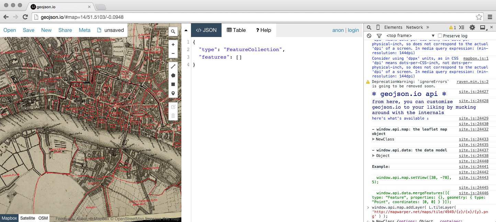

## The Data

All source data for the Defoe project ([A “Frightful Number!”](/plague-year) – Mapping Daniel Defoe’s A Journal of the Plague Year) was catalogued by Adam Sills in spreadsheets, with one record for each *event*. An itinerary event consists of a time period, which may be a specific date or generalized, a parish or specific location, optional notes, and optional number dead or buried.

For the purpose of the navigable timeline and data view, we've thus far simply relied on the sequence of events. Many events contain very broad date ranges, based on a portion of the narrative, or very general time periods, consisting of seasons or "late in the year" descriptions. Without translating these time periods into specific calendar dates, it becomes very difficult to rely on date values as a sorting mechanism to render a timeline. This should be acknowledged and addressed in future Itinerary projects as well.

The spreadsheets were converted to *comma-separated values* (CSV) data files to interact with programmatically, and allowing ongoing edits to be made in spreadsheet applications such as Excel, Numbers or LibreOffice, providing those edits treat all data fields as text and save modified data consistently back to CSV format.

A number of fields were added throughout the project. The following fields are relied upon in the current iteration of Itinerary:

1. `date_year`: This field follows the sequence of events and date descriptions so that events may be grouped, and displayed, by year.
2. `parish_id`: Each event that cites a parish as location maps to that parish by a lookup ID in a parish data file.
3. `location_latitude`: Location-specific events need to be translated to latitude, longitude location on a modern map. Latitude is captured here.
4. `location_longitude`: Location-specific events need to be translated to latitude, longitude location on a modern map. Longitude is captured here.

The following fields are also relied on for the display and mapping of data:

1. `date_descriptive`: Captured in the original catalog of data from the text, this combined with `parish` or `location_descriptive` comprises the title of the event.
2. `parish`: Captured in the original catalog of data from the text, this combined with `date_descriptive` comprises the title of the event, and is used to link the event to a highlighted parish on our map.
3. `location_descriptive`: Captured in the original catalog of data from the text, this combined with `date_descriptive` comprises the title of the event. It must be translated to latitude and longitude values to be displayed on the map, or be complementary to reference of a parish.
4. `notes`: Captured in the original catalog of data, we display notes for each event where available.
5. `buried_plague`, `buried_plague_total`, `buried_parish_total`, `buried_total`: We display all of these values where available.

## Historic Map Images

Two challenges exist in plotting historic locations on historic maps that have been scanned for digital use:

1. We need a system to plot those locations at x, y coordinates within the w, h (width, height) boundaries of the map. A latitude, longitude coordinate system addresses this challenge once the map image has been aligned to a modern map.
2. We need to align the map with a modern map.

NYPL Labs at the New York Public Library published [From Paper Maps to the Web: A DIY Digital Maps Primer](http://www.nypl.org/blog/2015/01/05/web-maps-primer) in January, 2015. This tutorial served as the starting point and primary resource in plotting literary data on historic map images using modern latitude & longitude coordinates. At the core of the tutorial is the use of [MapWarper.net](http://mapwarper.net).

> [Map Warper is] a free to use, open source map warper / map georectifier, and image georeferencer tool. This project is supported by Topomancy LLC and the New York Public Library.

Map Warper is currently available as a public resource. Maps can be saved privately within an account login, or made available publicly. Map Warper is open source, and can be downloaded from GitHub to run on your own server.

Map Warper distorts a historic map image to align with "the Mercator projection which is used in most web mapping projects such as OpenStreetMap or Google Maps." This process ensures that a flat map rendering is aligned with a latitude, longitude coordinate system and also corrects for historical inaccuracies. The resulting, distorted image is said to have been rectified.

We rectify the map by asserting coordinating control points on the historic map image alongside a modern map interface. The more control points we assert, the more accurate the rectified map will be. When we instruct Map Warper to rectify the map, it saves a set of rectified images. In our application, we directly reference these images via a Map Warper URL, which can be used as a tile layer in MapBox API code. A tile layer allows us to pan and zoom our historic map image just as we would a MapBox or Google Maps interface, with the image updated on-demand. It is important to provide a large image to Map Warper, with sufficient resolution that we can zoom in on image details. We uploaded 100MB TIFF files provided by [source...?] as a starting point for the Plague map.

#### Map Rectification with Map Warper.

Upon logging in to Map Warper we navigate to **Upload Map** to start a new map. The only requirements here are the **Title** field and to upload an image file. As stated, we've uploaded very large files in non-web formats successfully. This map will now appear under **My Maps**.

If we click on a map under **My Maps**, we can view the map as uploaded (**Show**). We can **Edit** the map, which will allows us to update those additional fields we saw when we uploaded the map.

Our focus in Map Warper is the **Rectify** tab. Here we see a two-paned view, with our historic map image alongside a modern map. Here we may zoom and pan both our map image and the modern map and assert *Control Points*: Locations we can identify in common to bind the map image to the modern map.

To add a control point, click the pencil icon and then click once on each corresponding point in both maps.

We can add any number of control points. The more control points that are established, the more accurate the rectified map will be.

Control points can be manually edited or deleted under **Control Points** below the two-paned interface. Note that Map Warper currently runs out of numbered pin icons at 149. That does not prevent you from adding more than 149 pins.

You may return to rectify the map as often as you'd like. Note, however, that if you are relying on a live MapWarper.net URL for a map and you rectify it again, you will alter the map displayed in your application, and which you may have relied on to draw parish polygons or plot points. You may introduce discrepancies between your plotted elements and your map image.

Once you've established enough control points, change **Resampling Method** to *Cubic Spline, slower but best quality* and click **Warp Image!**

The rectified map lives at a Map Warper URL that will be embedded in our application. We can find this URL under *Tiles (Google/OSM scheme)* under the **Export** tab in Map Warper.

#### Plotting Points and Drawing Boundaries with GeoJSON.io

The rectified map can not only be embedded directly in our application, but is also useful in determining latitude and longitude for historic locations found in our data. We are currently utilizing GeoJSON.io with our rectified map to determine latitude, longitude locations or draw parish outlines.

Start by visiting [GeoJSON.io](http://geojson.io). For "A Plague Year," we want to double-click to zoom the map in on London. For this map in particular, we zoom in on the Thames, and then Tower of London, which has proved to be a reliable reference point.

We're going to use a feature of our modern browser to edit the map display so that we can reference our warped historic map when plotting points or drawing shapes. To do so, right-click on a location in the map and choose **Inspect Element**. In the browser panel that opens, look for the **Console** tab.

The Console allows us to issue commands to JavaScript running in the page we're viewing. Borrowing heavily from the NYPL tutorial, we need to undertake the following steps (referencing the Chrome web browser):

1. At GeoJSON.io, zoom in to London, until you can see the Tower of London along the Thames.
2. Right-click on the map, choose **Inspect Element**. In the panel that opens, click on **Console**, which may be hidden under a &raquo;.
3. Copy the following text and paste it into the command line in the Console: `window.api.map.addLayer( L.tileLayer( 'http://mapwarper.net/maps/tile/4949/{z}/{x}/{y}.png' ) );`
4. Under the **Export** tab in Map Warper, copy your *Tiles (Google/OSM Scheme)* URL, which should look like `http://mapwarper.net/maps/tile/8951/{z}/{x}/{y}.png`.
5. Highlight the URL between single quotes in the code you pasted into the console, delete it, and paste in your map's URL. Hit Enter.

Your map image should now be displayed over the map in GeoJSON.io, like so:

The fourth icon down in the toolbar over the map resembles a map pin. You may click on this pin and then click a point on the map to place it. This will display the latitude and longitude of that pin on the right, which you may install into your itinerary data.

To draw polygons, which we are using to render parish boundaries, simply continue clicking the pin and the map once for each boundary vertex. Be sure to do this in sequence; If you err, delete the erroneous pin and continue. As you place pins, you'll see the GeoJSON data populate in the pane to the right. When drawing polygons, do not reproduce the 1st pin. The last pin should be at the nearest neighbor vertex to comprise the shape.

When complete, hover over the **Save** link at the top and choose *GeoJSON*. This will immediately download a file to your computer. Rename that file in the `parish-###.geojson` convention to match your lookup table (see below) and connect the parish coordinates to your dataset.

## The Application

### Jekyll for Data

The Itinerary project uses the open source site generator Jekyll to render content and data in HTML and JSON files. HTML files comprise the navigable pages of the website and the tabular output of the itinerary data. JSON files provide the data that drives the timeline and map interface. The application uses the [GitHub Pages](https://pages.github.com/) approach to Jekyll projects and [Bundler](http://bundler.io/).

There are two Jekyll loops in the itinerary page for a given map:

1. An initial loop through the parishes data file, to set up CSS styles to color code those entries in the tabular itinerary data table.
2. A loop through the itinerary events, grouped by year, to generate the itinerary data table.

There is also a Jekyll loop in the `datajson/*.json` file for the particular map/page, to convert the CSV data for the itinerary to JSON format for the JavaScript application to consume.

### JavaScript and GeoJSON Application

At the time of this writing, the JavaScript code that renders the map and timeline interfaces, and enables interaction with them, is tightly coupled to *"The Plague Year's"* data. This needs to be abstracted further through future iterations of the project and as more data is encountered. A challenge in fully abstracting the application lies in knowing what the scope of unique, valuable data is inherent in a given project, and determining how that should be displayed in the map and timeline. For "Plague Year," that meaningful data includes not just event dates and event locations, but also plague and buried counts, which must be embedded in HTML markup for display and formatting.

All script functions reside in `_source/ui/js/script.js`, with variables for the map set in `_source/index.html`. The intent there is to enable setting parameters for a particular map in the page it's embedded in, with code that applies to all maps in `script.js`. As stated, though, code that is coupled to the unique project does reside in `script.js` as well. One should take note of the following values set in `index.html` for the "Plague" map:

* `datajson`: The name of the `.json` file containing the events that render the timeline interface. This is expected to reside in the `_source/datajson` directory and contains Jekyll code to generate JSON from a corresponding data file in CSV format. This data should mirror the data that Jekyll is directly outputting in this HTML page.
* `attribution_historic`: Each map layer accommodates attribution content in the lower right of the map. This variable stores the string of text that appears on the historic map layer.
* `attribution_mapbox`: Each map layer accommodates attribution content in the lower right of the map. This variable stores the string of text that appears on the modern MapBox map layer.
* `tile_layer_historic`: The URL to the tile layer for our rectified map, currently residing at MapWarper.net.
* `tile_layer_mapbox`: The URL to the tile layer for the MapBox map. This is a non-map-specific URL, as MapBox also relies on a Map ID.
* `mapbox_id`: The Map ID for the MapBox map we're using.
* `historic_toggle_label`: Unfortunately I have not found a way to pass these parameters to JavaScript for all browsers as they reside in the lefthand of an object attribute being assigned. At the time of this writing, I'm using a generic label "Historic Map" in the script.
* `modern_toggle_label`: Unfortunately I have not found a way to pass these parameters to JavaScript for all browsers as they reside in the lefthand of an object attribute being assigned. At the time of this writing, I'm using a generic label "London 2015" in the script.
* `map_center`: The latitude and longitude that the map should center on when initially rendered. Note that in the "Plague" map, we are centered on London. Dynamically centering the map could skew our initial display, as the initial timeline events take place in Holland.
* `map_zoom`: The initial zoom level of the rendered map, adjusted to suit the level of detail and dimensions of the map we've implemented.

#### The JavaScript

Once the map layers are set up and rendered, we run the application through event and parish loops. In "A Plague Year," we are looking at three data files. Note that all "live" data files referenced by the JavaScript application are assumed to reside in the generated `_site` directory, which is where the website is served from.

1. `datajson/parishes.json`: `parishes.csv` is a lookup table of all parishes to be rendered, with each entry to corresponding to a `parish-###.geojson` file with the entry ID in its name. These entry IDs are also cited in the corresponding itinerary data file.
2. `datajson/a-frightful-number-plague.json`: This is a per-map data file, where `a-frightful-number-plague.json` corresponds to the `a-frightful-number-plague.csv` itinerary data source.
3. `geojson/parish-###.geojson`: Each parish that we wish to render on the map must have a corresponding geojson file establishing its vertices. The steps to create these files outlined previously.

Our first call to `$.getJSON( 'datajson/'+datajson )` fetches the `datajson/a-frightful-number-plague.json` file. The `$.each` loop that follows sets up each entry in the navigable timeline and also establishes an array of location markers for any specific latitude, longitude locations that exist in the itinerary. Here we are generating explicit HTML markup for each timeline entry coupled to unique data and content available for each entry.

Following that loop, and within our successful fetch of the itinerary data, we fetch the next file with `$.getJSON( "datajson/parishes.json" )`. This is the data generated from our lookup table of parishes. The subsequent loop fetches each parish's corresponding `parish-###.geojson` file to draw the parish on the map. The parish polygon is made clickable, and its popup is defined here and populated with initial content.

Following the rendering of parishes, we call the `currentEvent()` function to set the timeline at the first event. When called, `currentEvent()` resets all parish polygons on the map to non-popup states, sets a marker in the timeline, visually and programmatically, and renders the appropriate content for that event. This reduces the rendering function for a timeline event to 1 function, regardless of whether we are stepping through the events or clicking on a particular event in any sequence.
